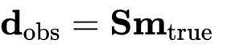
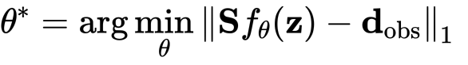
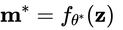
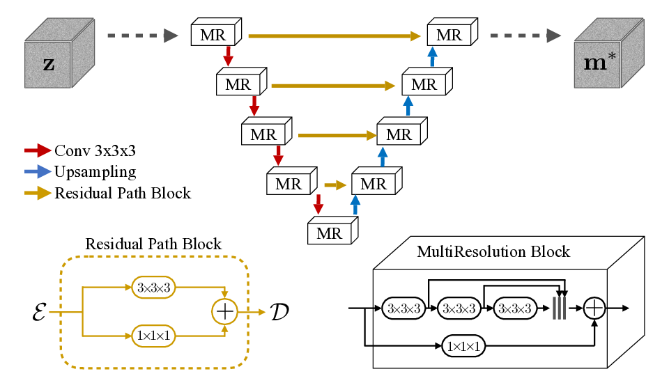

# Unsupervised 3D Seismic Data Reconstruction Based On Deep Prior

This reposittory contains codes and examples of the related paper submitted to
IEEE Geoscience and Remote Sensing Letters (id. GRSL-00712-2020).

#### Authors
[Fantong Kong](mailto:kft_upc@hotmail.com)<sup>1</sup>,
[Francesco Picetti](mailto:francesco.picetti@polimi.it)<sup>2</sup>,
Vincenzo Lipari<sup>2</sup>, Paolo Bestagini<sup>2</sup>,
Xiaoming Tang<sup>1</sup>, and Stefano Tubaro<sup>2</sup>

1: School of Geosciences - China University of Petroleum (East), Qingdao, China<br>
2: Dipartimento di Elettronica, Informazione e Bioingegneria - Politecnico di Milano, Italy

## Abstract
Irregularity and coarse spatial sampling of seismic data strongly affect the performances
of processing and imaging algorithms. Therefore, interpolation is a necessary pre-processing
step in most of the processing workflows. In this work, we propose a seismic data interpolation
method based on the deep prior paradigm: an ad-hoc Convolutional Neural Network is used as
a prior to solve the interpolation inverse problem, avoiding any costly and prone-to-overfitting training stage.
In particular, the proposed method leverages a multi resolution U-Net with 3D convolution
kernels exploiting correlations in 3D seismic data, at different scales in all directions.
Numerical examples on different corrupted synthetic and field datasets show the effectiveness
and promising features of the proposed approach.

The inverse problem is defined starting from the sampling equation:



that is solved using the deep prior paradigm by



The estimate of the true model is then obtained as the output of the optimized network:



The architecture we propose is the MultiResolution UNet:



## Setup and Code Organization
The code mainly relies on top of pytorch. You can recreate our conda environment named `dpi`
(acronym for "deep prior interpolation") through
```
conda create env -f environment.yml
``` 
Then, activate it with `source activate dpi` before running any example.<br>
**NOTE**: if you have initialized conda through `conda init`, use `conda activate dpi` instead.

This python project is organized as follows:
 - `main.py` is the main script that actually does the interpolation
 - `parameter.py` contains the run options that the main will parse as shell arguments
 - `architectures.py` contains pytorch implementations of the networks and loss functions
 - `data.py` contains some data management utilities
 - `utils.py` contains some general purpose utilities

## Usage Examples
Here we report the example tests included in the paper.
Results have been obtained as follows:
   
 - **Simple 3D hyperbolic data**: we show how our method works when interpolating both
 regular and irregular data showing simple hyperbolic events.
 These simulations can be run with:
     ```
     # irregular subsampling
     python main.py --imgname hyperbolic3d.npy --maskname hyperbolic3d_irregular_066.npy --datadim 3d --gain 20 --upsample trilinear --epochs 3000
     # regular subsampling
     python main.py --imgname hyperbolic3d.npy --maskname hyperbolic3d_regular_066.npy --datadim 3d --gain 50 --upsample trilinear --epochs 3000
     ```

 - **MultiRes UNet 2D vs. 3D kernels**: we show the improvements obtained by
 eploiting fully 3D convolution kernels.
 These simulations rely on the Marmousi model and they can be run with:
     ```     
     # 2,5D by adjacent common shot gathers
     python main.py --imgname marmousi.npy --maskname marmousi_regular_050.npy --datadim 2.5d --gain 1e8 --upsample bilinear --epochs 2000 --slice YT --imgchannel 4     
     # fully 3D
     python main.py --imgname marmousi.npy --maskname marmousi_regular_050.npy --datadim 3d --gain 1e8 --upsample nearest --epochs 2000
     ```
   
 - **Netherlands F3 Field data**:
     ```
     python main.py --imgname netherlandsf3.npy --maskname netherlandsf3_irregular_050.npy --datadim 3d --gain 0.005 --upsample trilinear --epochs 2000
     ```